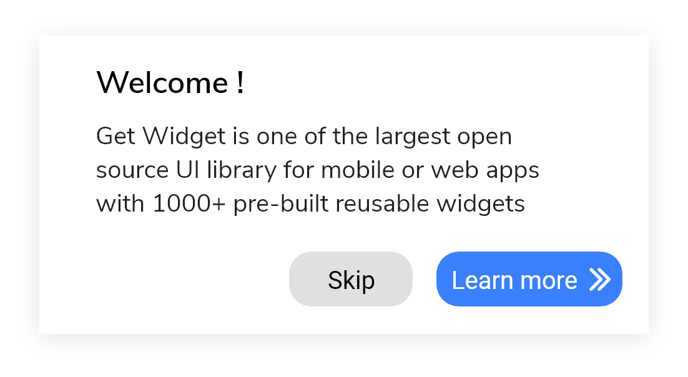

# GF Alert


###
## Alert Info
### Usage

**GFAlert** should be wrapped inside the **GFFloating** Widget.The **child** of the **GFFloatingWidget** takes **GFAlert** as its argument and the **body** takes any kind of widgets. The Alert code is as shown below. 

```dart
import 'package:getwidget/getwidget.dart';
 
 return Scaffold(
   body:GFFloatingWidget(
     child:GFAlert(
              title: 'Welcome !',
              content: 'Get Flutter is one of the largest Flutter open-source UI library for mobile or web apps with  1000+ pre-built reusable widgets.',
              bottombar: Row(
                 mainAxisAlignment: MainAxisAlignment.end,
                 children: <Widget>[
                    GFButton(
                      onPressed: (){
                      setState(() {
                        showalert=false;
                    });
                  },
                    shape: GFButtonShape.pills,
                    icon: Icon(Icons.keyboard_arrow_right, color: GFColors.getGFColor(GFColor.white),),
                    position: GFPosition.end,
                    text: 'Learn More',)
                ],
              ),
            )
   body:Text('body or any kind of widget here..')
 )
)
```

### Alert with multiple buttons



Alert can have two or more buttons for call of action in the **bottombar** of the alert widget. The code below shows the multiple buttons 

```dart
import 'package:getwidget/getwidget.dart';
 
 return Scaffold(
   body:GFFloatingWidget(
     child:GFAlert(
              title: 'Welcome !',
              content: 'Get Flutter is one of the largest Flutter open-source UI library for mobile or web apps with  1000+ pre-built reusable widgets.',
              bottombar: Row(
                 mainAxisAlignment: MainAxisAlignment.end,
                 children: <Widget>[
                  GFButton(
                      onPressed: (){
                      setState(() {
                        showalert=false;
                    });
                  },
                    shape: GFButtonShape.pills,
                     child: Text('Skip',style: TextStyle(color: Colors.black)),
                   SizedBox(
                    width:5
                    ),
                    GFButton(
                      onPressed: (){
                      setState(() {
                        showalert=false;
                    });
                  },
                    shape: GFButtonShape.pills,
                    icon: Icon(Icons.keyboard_arrow_right, color: GFColors.getGFColor(GFColor.white),),
                    position: GFPosition.end,
                    text: 'Learn More',)
                ],
              ),
            )
   body:Text('body or any kind of widget here..')
 )
)
```

### Types of Alert

There are the types of alerts ie , `basic` , `rounded` and `fullWidth` . The default alert is a basic alert. The below code shows the **rounded** alert. For **fullWidth** alert replace **rounded** with **fullWidth**

```dart
import 'package:getwidget/getwidget.dart';
 
 return Scaffold(
   body:GFFloatingWidget(
     child:GFAlert(
              title: 'Welcome !',
              content: 'Get Flutter is one of the largest Flutter open-source UI library for mobile or web apps with  1000+ pre-built reusable widgets.',
              type: GFAlertType.rounded,
              bottombar: Row(
                 mainAxisAlignment: MainAxisAlignment.end,
                 children: <Widget>[
                  GFButton(
                      onPressed: (){
                      setState(() {
                        showalert=false;
                    });
                  },
                    shape: GFButtonShape.pills,
                     child: Text('Skip',style: TextStyle(color: Colors.black)),
                   SizedBox(
                    width:5
                    ),
                    GFButton(
                      onPressed: (){
                      setState(() {
                        showalert=false;
                    });
                  },
                    shape: GFButtonShape.pills,
                    icon: Icon(Icons.keyboard_arrow_right, color: GFColors.getGFColor(GFColor.white),),
                    position: GFPosition.end,
                    text: 'Learn More',)
                ],
              ),
            )
   body:Text('body or any kind of widget here..')
 )
)
```

### Positioning of Alert

Alerts can be positioned accordingly inside the **GFFloating** Widget. The positioning takes two parameters ie, **horizontalPosition** and **verticalPosition**. The usage of these is shown below.

```dart
import 'package:getwidget/getwidget.dart';

body:GFFloatingWidget(
    horizontalPosition:40.0,
    verticalPosition:20.0,
    child:GFAlert(
    title: 'Welcome!',
  ),
 body:Text('body or any kind of widget here..')
)
```


### Custom Properties

|  |  |
| :--- | :--- |
| **child** | **child** of type \[Widget\] which is alternative to **title**. **title** will get priority over **child** |
| **contentChild** | **contentchild** of type \[Widget\] which is alternative to **content**. **content** will get priority over **contentchild** |
| **titleTextStyle** | changes the style of the **title**  not for the **child** |
| **backgroundColor** | used to change the backgroundColor of the GFAlert |
| **contentTextStyle** | changes the style of the **content**  not for the **contentChild** |
| **width** | used to control the width of the **Alert** |
| **alignment** | used to align the **title or content** to desired position  |

