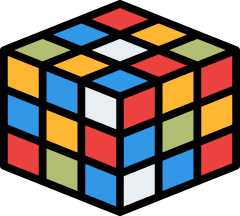

# GF Animation

### GF Animation Info


### Types of GF Animation :

### 1. Rotation

GFAnimation property `type: GFAnimationType.rotateTransition` ,  creates a rotation transition for the child of widget. Animates the rotation of a widget.


```text
  AnimationController controller;
  Animation<double> animation;
  
  @override
  void initState() {
    super.initState();
    controller =
        AnimationController(duration: const Duration(seconds: 5), vsync: this);
    animation = new CurvedAnimation(parent: controller, curve: Curves.linear);
    controller.repeat();
  }

GestureDetector(
  onTap: () {
    controller.repeat();
  },
  child: GFAnimation(
    turnsAnimation: animation,
    controller: controller,
    type: GFAnimationType.rotateTransition,
    alignment: Alignment.center,
    child: Image.asset(
      'assets image here',
      width: 80,
      height: 80,
    ),
  ),
),
```

### 2. Scaling

GFAnimation property `type: GFAnimationType.scaleTransition` ,  creates a scale transition for the child of widget. Animates the scale of a transformed widget.



```text
  AnimationController controller;
  Animation<double> animation;
  
  @override
  void initState() {
    super.initState();
    controller =
        AnimationController(duration: const Duration(seconds: 5), vsync: this);
    animation = new CurvedAnimation(parent: controller, curve: Curves.linear);
    controller.repeat();
  }

GestureDetector(
  onTap: () {
    controller.repeat();
  },
  child: GFAnimation(
    scaleAnimation: animation,
    controller: controller,
    type: GFAnimationType.scaleTransition,
    child: Image.asset(
      'assets image here',
      width: 80,
      height: 80,
    ),
  ),
),
```

### 3. Alignment


GFAnimation property `type: GFAnimationType.align` ,  creates a alignment transitions for the child of widget. Animates the position alignment of a widget over a given duration whenever alignment changes.

```text
GFAnimation(
  duration: Duration(seconds: 2),
  alignment: Alignment.bottomLeft,
  type: GFAnimationType.align,
  child: Image.asset(
    'assets image here',
    width: 80,
    height: 80,
  ),
),
```

### 4. Slide Transition


GFAnimation property `type: GFAnimationType.slideTransition` ,  creates a fractional translation transitions for the child of widget. Animates the position  of a widget relative to its normal position.

```text
 Animation<Offset> offsetAnimation;
  @override
  void initState() {
    super.initState();
    controller =
        AnimationController(duration: const Duration(seconds: 5), vsync: this);
    animation = new CurvedAnimation(parent: controller, curve: Curves.linear);
    controller.repeat();
    offsetAnimation = Tween<Offset>(
      begin: Offset(-5, 0),
      end: const Offset(0, 0),
    ).animate(CurvedAnimation(
      parent: controller,
      curve: Curves.linear,
    ));
  }

Container(
  width: MediaQuery.of(context).size.width,
  child: GFAnimation(
    controller: controller,
    slidePosition: offsetAnimation,
    type: GFAnimationType.slideTransition,
    child: Image.asset(
      'assets image here',
      width: 80,
      height: 80,
    ),
  ),
),
```

### 5. Size


GFAnimation property `type: GFAnimationType.size` ,  creates a widget that animates its size. Animates the widget that automatically transitions its size in a given duration whenever the given child's size changes.

```text
bool selected = false;

AnimationController controller;
Animation<double> animation;
  
@override
  void initState() {
    super.initState();
    controller =
        AnimationController(duration: const Duration(seconds: 5), vsync: this);
    animation = new CurvedAnimation(parent: controller, curve: Curves.linear);
    controller.repeat();
  }

GFAnimation(
  onTap: () {
    if (mounted) {
      setState(() {
        selected = !selected;
      });
    }
  },
  width: selected ? 100 : 50,
  height: selected ? 100 : 50,
  type: GFAnimationType.size,
  controller: controller,
  child: Image.asset(
    'assets image here',
     width: 80,
    height: 80,
  ),
),
```

### 6. Container

GFAnimation property `type: GFAnimationType.container` ,  creates a widget that animates its size. Animates the widget that automatically transitions its size in a given duration whenever the given child's size changes.

```text
AnimationController controller;
Animation<double> animation;
double _fontSize = 30;
  
@override
  void initState() {
    super.initState();
    controller =
        AnimationController(duration: const Duration(seconds: 5), vsync: this);
    animation = new CurvedAnimation(parent: controller, curve: Curves.linear);
    controller.repeat();
  }

GFAnimation(
  width: 50,
  changedWidth: 100,
  height: 50,
  changedHeight: 100,
  activeColor: Colors.transparent,
  color: Colors.transparent,
  fontSize: _fontSize,
  type: GFAnimationType.container,
  child: Image.asset(
    'assets image here',
     width: 80,
    height: 80,
  ),
),
```

### Custom Properties

Look and feel of the **GFAnimation** can be customized using the GFAnimation properties.

|  |  |
| :--- | :--- |
| **duration** | The duration for animation to perform |
| **reverseDuration** | The duration for reverse animation to perform |
| **alignment** | Defines how the animated widget is aligned during Animation. |
| **activeAlignment** | Defines how the animated widget is aligned\(after the onTap\) during Animation. |
| **child** | The child of type \[Widget\] to display animation effect. |
| **curve** | Determines the animation curve. Defaults to \[Curves.linear\]. |
| **type** | type of \[GFAnimation\] which takes the type ie, align, size, container, rotateTransition, scaleTransition, slideTransition, and textStyle for the \[GFAnimation\] |
| **width** | defines \[AnimatedContainer\] initial width |
| **changedWidth** | defines the width of \[AnimatedContainer\] upto which it can expand during animation |
| **height** | defines \[AnimatedContainer\] initial height |
| **changedHeight** | defines the height of \[AnimatedContainer\] upto which it can expand during animation |
| **activeColor** | defines the color of \[AnimatedContainer\] when onTap triggers |
| **color** | defines the color of \[AnimatedContainer\] |
| **padding** | defines \[child\]'s or \[AnimatedContainer\] padding |
| **margin** | defines \[child\]'s or \[AnimatedContainer\] margin |
| **onTap** | Called when the user taps the \[child\] |
| **turnsAnimation** | For GFAnimationType.rotateTransition, customized turns animation can be added to \[RotationTransition\] widget |
| **scaleAnimation** | For GFAnimationType.scaleTransition, customized scale animation can be added to \[ScaleTransition\] widget |
| **controller** |  Type of \[AnimationController\], its a controller of an animation. |
| **textDirection** | Defines direction of the \[AnimatedDefaultTextStyle\] TextDirection i.e \[ltr,rtl\] |
| **slidePosition** | For GFAnimationType.slideTransition, which animates the position of a widget. |
| **style** | Defines the \[TextStyle\] of \[AnimatedDefaultTextStyle\] |
| **textAlign** | Defines the \[TextAlign\] of \[AnimatedDefaultTextStyle\] |
| **textOverflow** | Defines the \[TextOverflow\] of \[AnimatedDefaultTextStyle\] |
| **maxLines** | Defines the \[maxLines\] of \[AnimatedDefaultTextStyle\] |
| **textWidthBasis** | Defines the \[TextWidthBasis\] of \[AnimatedDefaultTextStyle\] |
| **fontSize** | Defines the \[fontSize\] of \[AnimatedDefaultTextStyle\] |
| **fontWeight** | Defines the \[fontWeight\] of \[AnimatedDefaultTextStyle\] |


